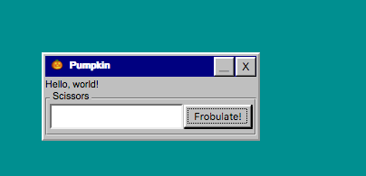

# react-windowed

[](https://travis-ci.org/gyng/react-windowed)
[](https://badge.fury.io/js/react-windowed)



A toy implementation of Windows-styled windows in React. I personally use it for wrapping around development tools.

## Installation

    npm install react-windowed

or

    yarn add react-windowed

## Usage

See `example/` for detailed usage.

```jsx
// Frobulator.jsx
import { Group, Widget } from 'react-windowed';

export default const () => (
  <Widget title="🎃 Pumpkin">
    <Group title="Scissors">
      <button>Frobulate!</button>
    </Group>
  </Widget>
);
```
